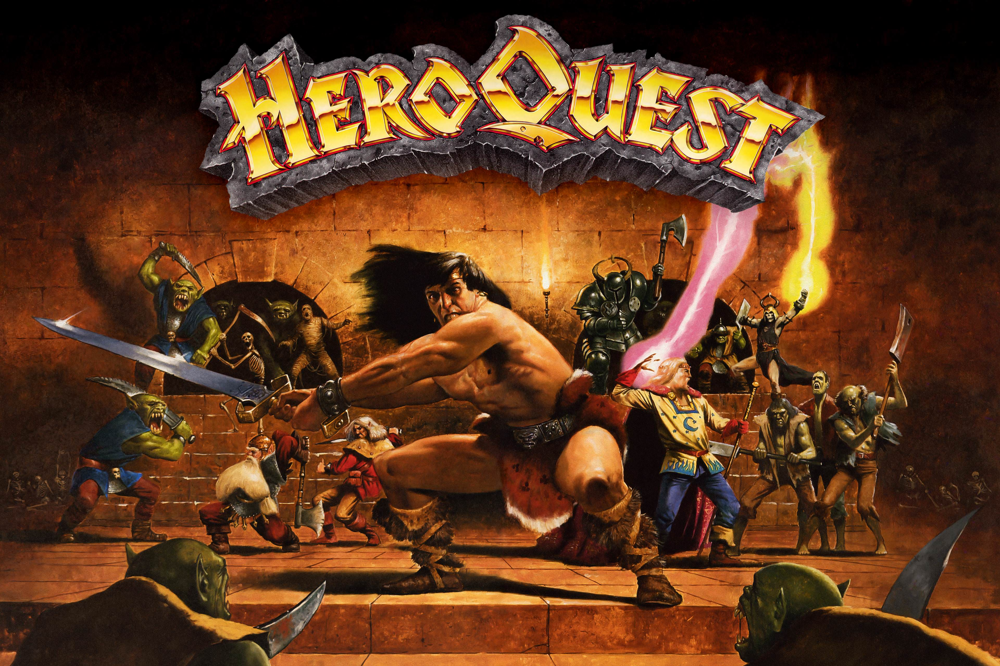
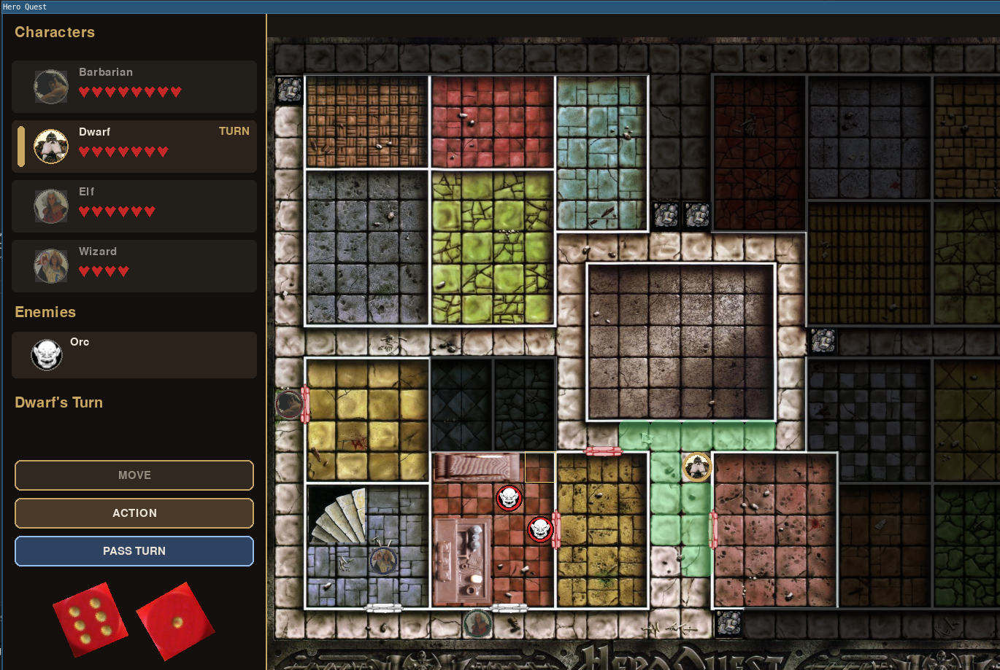

# HQ



Unofficial Python and pygame project for a HeroQuest-style dungeon crawler.



## Project state

What is implemented:
* one full quest #1
* movements
* combats
* enemy AI
* multi-language support (currently en and fr)
* hidden doors

What needs to be implemented:
* spells
* traps
* chest, treasures
* multiplayer mode
* quest editor
* other quests

## Project Layout

```text
hq/
├── assets/
│   ├── audio/
│   │   ├── music/
│   │   └── sfx/
│   ├── fonts/
│   └── graphics/
│       ├── sprites/
│       ├── tiles/
│       └── ui/
├── data/
│   ├── maps/
│   └── quests/
├── docs/
├── src/
└── tests/
```

## Quick Start

1. Create a virtual environment.
2. Install the project in editable mode.
3. Run the prototype window.

```bash
python -m venv .venv
source .venv/bin/activate
pip install -e .
hq-game
```

You can also start it with:

```bash
python src/main.py --lang=fr   # French
python src/main.py --lang=en   # English (default)
python src/main.py             # uses config.json "lang" value

options:
  -h, --help       show this help message and exit
  --debug          Enable debug mode
  --lang LANG      Language override (en, fr, …)
  --fullscreen     Force fullscreen mode
  --no-fullscreen  Force windowed mode
```

File `src/config.json` contains some configurable parameters (like language or fullscreen).

## Disclaimer

This repository is an unofficial fan project and prototype. It is not owned by, approved by, endorsed by, sponsored by, or affiliated with Hasbro, Avalon Hill, HeroQuest, Milton Bradley, Games Workshop, Stephen Baker, or the original creators and publishers of HeroQuest.

The HeroQuest name and related franchise elements are protected by copyright, trademark, and other intellectual property laws and belong to their respective rights holders. Current HeroQuest branding is associated with Hasbro and Avalon Hill, while the original 1989 board game was published by Milton Bradley in cooperation with Games Workshop.

Original code in this repository is separate from the HeroQuest intellectual property and is distributed under the license in this project.

## Thanks to

Thanks to `https://forum.yeoldeinn.com`, and `https://github.com/hghero/HeroQuest` for inspiration (and also I took the liberty to take graphics from them).
Some sounds found on the internet may not be free of rights, if so please inform me and I will remove them.